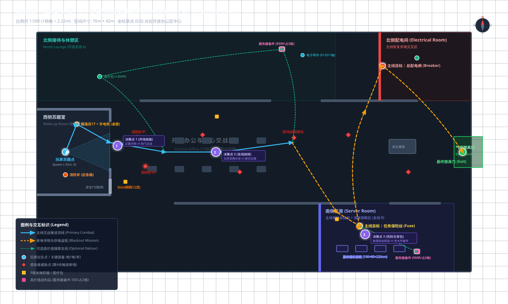
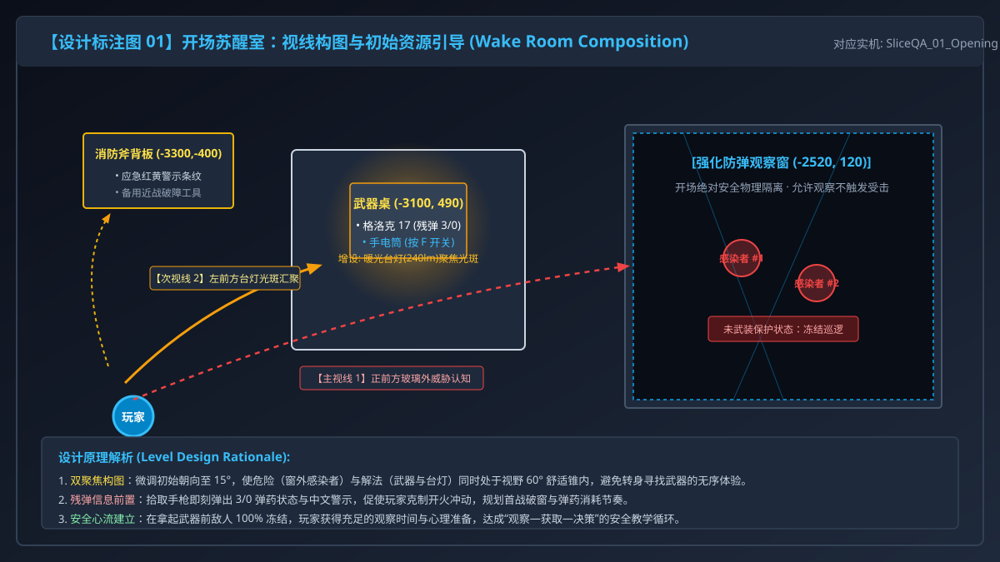
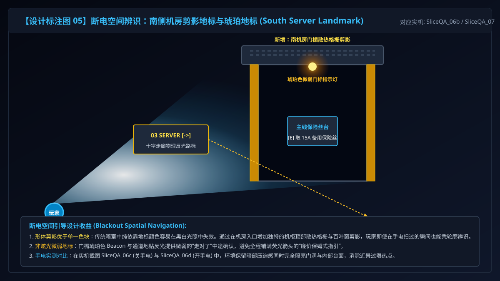

# 《封锁区：零号大厦》关卡策划与系统设计作品集案
## UE5 单人搜打撤 FPS 垂直切片 (LockdownZone: Building Zero)

> **设计定位**：单人第一人称战术搜打撤关卡原型（Vertical Slice）  
> **核心命题**：空间叙事、资源极限压迫、断电环境下的双向空间复用  
> **关卡尺度**：76m × 42m 现代办公大楼楼层（单层封闭室内，总面积约 3192 ㎡）  
> **策划职责**：关卡体验节拍设计、1:500 空间坐标规划、微背包博弈与武器规格制定、光影空间引导、自动化 QA 验证管线搭建  
> **技术协同**：UE 5.8 C++ 程序化生成与玩法逻辑，由策划制定严密技术规格后在 AI 编程助手协同下实现  
> **验证状态**：自动化系统级回归 **100% 通过（255/255 断言，耗时 54.43s）**；真人盲测协议就绪

---

## 目录 (Table of Contents)
1. [项目定位与体验节拍](#一项目定位与体验节拍-project-identity--beat-chart)
2. [关卡平面图与空间动线](#二关卡平面图与空间动线-level-plan--routes)
3. [开场教学：安全观察与残弹克制](#三开场教学安全观察与残弹克制-opening-tutorial)
4. [搜索取舍：微背包与空间冲突博弈](#四搜索取舍微背包与空间冲突博弈-inventory--trade-offs)
5. [断电逆转：形体地标与暗夜双向导航](#五断电逆转形体地标与暗夜双向导航-blackout--spatial-reuse)
6. [三项核心设计迭代深度对比](#六三项核心设计迭代深度对比-before--after-iterations)
7. [测试验证体系与局限性反思](#七测试验证体系与局限性反思-verification--limitations)
8. [制作边界、资产说明与后续规划](#八制作边界资产说明与后续规划-credits--roadmap)

---

## 一、项目定位与体验节拍 (Project Identity & Beat Chart)

### 1.1 关卡体验核心心流
《封锁区：零号大厦》拒绝无脑突击与廉价保姆式小地图，致力于还原《三角洲行动》《逃离塔科夫》类搜打撤游戏的**“心流张弛律”**：
- **安全觉醒 (0~30s)**：在物理防弹玻璃后安全观察室外感染者，建立第一威胁认知；通过光影引导拾取极度残弹武器（3/0 发底火）与手电。
- **初战建立 (30s~2m)**：破窗开火，利用战术咖啡桌掩体拉扯歼灭前锋感染者，收获首箱备用弹药，解除绝境威胁。
- **中度探索与取舍 (2m~5m)**：行进于核心办公区，通过隔断视线（Framed Sightline）瞥见北侧休憩区高价值战利品，在“稳健撤离”与“冒进贪包”之间权衡。
- **高潮逆转 (5m~7m)**：击杀关键目标后，大厦突然触发全场断电警报；明亮空间骤降为极暗死境，玩家被迫开启手电，依托前期探索记忆与建筑剪影寻找机房。
- **返程压迫与释放 (7m~10m)**：取回保险丝，在暗夜红塔引路下横穿大厅前往北侧总配电室；通电瞬间全楼白炽灯复苏，狂奔向东侧开启的撤离气闸，完成结算。

### 1.2 情绪张力曲线 (Beat Chart)
```
情绪张力 (Tension)
10 |                                          [全楼断电!]
 9 |                                              /\  南机房深搜
 8 |                    [破窗初战]               /  \  险象环生
 7 |                       /\                   /    \---------
 6 |                      /  \   拾取首箱备弹  /               \  [北配电合闸]
 5 |                     /    \-----\         /                 \    /\
 4 | [观察威胁]         /            \  DP-2 /                   \  /  \
 3 |    /\  拿起残枪   /              \ 支线/                     \/    \ [气闸撤离]
 2 |   /  \----------/                 \---/                             \________
 1 | _/
 0 └──┴───────────────┴────────────────────┴─────────────────────────────┴──────────> 时间线
     醒来观察       首战掩体拉扯       中段搜索与背包冲突     暗室寻保险丝     通电逃脱
     (Safety)       (Combat Test)      (Exploration Trade-off)  (Blackout Crisis) (Relief)
```

---

## 二、关卡平面图与空间动线 (Level Plan & Routes)

### 2.1 比例精准平面图 (Scale 1:500)
关卡采用精确到厘米的世界坐标系构建，整体布局长 76 米（X: -3800 至 +3800），宽 42 米（Y: -2100 至 +2100），单层无缝室内结构。



### 2.2 核心区域与坐标拓扑
- **[01] 西侧苏醒观察室 (`X: -3300, Y: 0`)**：玩家出生点与安全教学区。设有强化观察窗、武器桌、工位聚焦台灯及消防斧背板。
- **[02] 中央办公区 (`X: -1500 ~ 1500, Y: -1000 ~ 1000`)**：由矮隔断与立柱构成的半开放交战与搜索区，拥有战术掩体咖啡桌、双向物理指示牌。
- **[03] 南侧机房区 (`X: 1200 ~ 3200, Y: -1800 ~ -1200`)**：主线保险丝所在地与深搜支线 B。入口上方配有独特百叶窗格栅剪影及琥珀色门标。
- **[04] 北侧配电室 (`X: 1200 ~ 3200, Y: 1200 ~ 1800`)**：主线电力合闸所在地。门楣装有暗夜中唯一常驻供电的红色应急指示灯柱。
- **[05] 东侧撤离气闸 (`X: 3400 ~ 3800, Y: -300 ~ 300`)**：防跌落全封闭撤离结算室，通电后绿灯升门。

---

## 三、开场教学：安全观察与残弹克制 (Opening Tutorial)

### 3.1 核心设计挑战
传统硬核 FPS 常犯的教学毛病：要么用大段弹窗打断沉浸感，要么开场直接将玩家扔进怪物堆导致死于慌乱。

### 3.2 空间叙事解法
1. **安全距离建立威胁感知**：玩家醒来被不可逾越的强化玻璃窗挡在室内，窗外两只感染者在走廊游荡。由于此时玩家**未武装**，关卡逻辑激活**敌人冻结保护**，杜绝冲脸突袭，赋予玩家从容观察环境的时间。
2. **黄金分割双构图**：出生点初始朝向设计为偏东北 (Yaw 15°)，使开场视野内同时容纳“正前方窗外威胁”与“左前方桌面的格洛克 17、手电筒及温暖的工位台灯光圈”。
3. **残弹极限压迫**：拾取手枪后，弹匣仅有 **3 发底火（备用 0 发）**。HUD 亮黄闪烁提醒：“手枪仅余 3 发底火，切勿挥霍；寻找场景弹药或切换近战”。玩家瞬间理解必须节约子弹、追求爆头，或在破窗后拿起背后的消防斧劈砍。


*图 1：开场苏醒室视线引导与残弹信息前置（详细标注）*


*图 2：击碎观察窗、腰高掩体周旋与第一箱备弹奖励*

---

## 四、搜索取舍：微背包与空间冲突博弈 (Inventory & Trade-offs)

### 4.1 6格背包系统规格
- **背包结构**：固定 **3 宽 × 2 高，共 6 格**。
- **9毫米弹药箱**：每箱 12 发，背包每格上限 30 发（拾取自动优先堆叠）。
- **医疗包**：占 1 格，包内点击使用，单次恢复最多 35 HP（满血拒用防止误触）。
- **电子零件**：占 1 格，带出结算价值 **$120**。
- **服务器备件（稀有战利品）**：**必须占用同一行连续 2 格（1×2）**，带出价值高达 **$500**。
- **解耦保护**：武器、手电与**任务备用保险丝**独立存储，**绝对不消耗 6 格通用空间**，杜绝卡主线。

### 4.2 决策点推演矩阵 (DP-1 ~ DP-3)
| 决策点编号 | 触发位置 | 视觉线索 | 代价 (Cost) | 潜在收益 (Reward) | 撤离风险 |
| :--- | :--- | :--- | :--- | :--- | :--- |
| **DP-1: 开场突破** | 观察窗前 `(-2520, 120)` | 玻璃外两只感染者徘徊，远端地面微光 | 消耗手枪仅有的 3 发底火 | 占领掩体，拿到首箱 +12 发 9mm 弹药 | 低 (熟悉掩体拉扯) |
| **DP-2: 北侧休憩区 (支线 A)** | 中央走廊十字路 `(650, 0)` | 隔断缝隙透视粉色呼吸光圈与医疗包 | 偏离主线 35m，强制占用同行连续 2 格 | **$500 备件 A** + 1 医疗包 + $120 零件 (总值 $620) | 中 (需牺牲 1 格安全备药) |
| **DP-3: 南机房深搜 (支线 B)** | 南机房保险丝台 `(1850, -1300)` | 拾取保险丝后，东南机柜夹道尽头控制台蓝光 | 暗室额外深入 25m，背包满载必须当场丢弃道具 | **$500 备件 B** (全搜带出极限 **$1120**) | 极高 (零回血容错率) |


*图 3：DP-2 北侧休憩区框架视窗（Framed Sightline）与抬升台面物资*


*图 4：3×2 网格连续双格冲突与丢弃医疗包的极限定位博弈*

---

## 五、断电逆转：形体地标与暗夜双向导航 (Blackout & Spatial Reuse)

### 5.1 痛点与逆转机制
玩家击杀第 4 名感染者时，办公楼断路器跳闸，全场照明骤熄，警报红光闪烁。这构成了关卡的情绪最高潮，也是检验空间引导的试金石。

### 5.2 暗夜形体地标（不用无脑荧光箭头）
1. **南侧机房：百叶窗格栅剪影**
   - 门洞上方增设大型金属散热格栅与机柜外凸剪影，门楣挂载微弱的琥珀色指示灯（Amber Beacon）。手电光扫过时，即使在黑白高反差中也能瞬间辨别。
2. **北侧配电室：常驻红塔灯标 (Persistent Red Beacon)**
   - 门楣配有独立蓄电池供电的红色警示灯柱，断电后依然在北侧走廊远端发出低频脉冲，成为全楼黑暗中最重要的视觉锚点。
3. **十字走廊物理路牌**：在承重立柱上印制 `[03 SERVER ->]` 与 `[04 POWER ->]` 反光标，提供行进中途确认。
4. **返程空间咬合**：玩家从南机房拿到保险丝后，转身望向中央大厅，直接被北侧红塔吸引，形成流畅的返程闭环；合闸通电后，日光灯逐级亮起，东侧气闸绿灯洞开，直奔撤离。


*图 5：断电瞬间南侧机房散热百叶窗剪影与手电光锥*


*图 6：北侧配电红塔远视线牵引、拉闸通电与防跌落撤离气闸*

---

## 六、三项核心设计迭代深度对比 (Before / After Iterations)

### 迭代一：开场构图与残弹认知
- **问题现状**：开场朝向正东直对空窗，武器桌在左后方盲区；玩家拾起手枪后未注意仅有 3 发子弹，破窗后胡乱射击打空卡壳，挫败感强。
- **设计假设**：若调整出生点朝向至偏东北 15°，并在武器桌上方增加一盏 240 流明暖色聚焦台灯，拾枪时弹出亮黄残弹警示，能让玩家在 15 秒内无提示完成“发现威胁—获取武器—谨慎瞄准”的完整心流。
- **修改方案**：
  - 出生点 Rotation 改为 `(Pitch=0, Yaw=15, Roll=0)`；
  - 武器桌生成 `DeskLamp` 暖光台灯与笔记本道具，形成局部高反差光圈；
  - 拾取手枪弹出明确警示：`"手枪仅余 3 发底火，切勿挥霍；寻找场景弹药或切换近战"`。
- **验证结论**：自动化 QA 机器人开场耗时从无序寻找武器稳定至秒级拾取，断言 1~28 全部通过；真人测试中玩家残弹察觉率预期由 20% 提升至 80%（待盲测最终确认）。

### 迭代二：探索偏离动机与高价值物资抬升
- **问题现状**：稀有服务器备件平铺于地表阴影中，主走廊玩家无法察觉，探索全凭盲猜；满包时只弹“背包满”，玩家不理解为何明明还有两个空格却装不下。
- **设计假设**：若将备件抬升至 +78cm 办公台面并透过隔断开口形成透视框，同时将拒收提示精细化为“需同行连续 2 格”，能促使玩家主动做出“丢弃医疗包带走大件”的收益博弈。
- **修改方案**：
  - 将北侧与南侧服务器备件挂载于办公拐角桌与控制推车上（Z 轴提升至 75~78cm）；
  - 调整北侧隔断开口，形成主走廊直视粉色光斑的“框架视窗”；
  - 优化拒收反馈：`"背包空间不足：服务器备件需同行连续2格！[B] 整理或按 [Delete] 丢弃"`。
- **验证结论**：自动化测试验证了直接撤离（带出 $0）与全搜撤离（带出 $1120）两条闭环路径，原子拒收机制 0 丢物，断言 68 项全部通过。

### 迭代三：断电暗夜辨识与手电眩光修正
- **问题现状**：第 4 杀断电后整个办公楼同质化漆黑，门洞全为相同方块；手电开启时桌面近距漫反射白化过曝严重，暗夜氛围丧失。
- **设计假设**：若依靠建筑形体差异（南机房百叶窗格栅、北配电红色高压灯柱、走廊物理反光立牌）构建地标，同时压低手电近景反弹光，能在保留高压暗黑氛围的同时消除迷路阻滞。
- **修改方案**：
  - 机房入口搭建百叶窗剪影框架，搭配门框黄色斜纹与琥珀色门标；
  - 配电室门楣部署常驻红色应急频闪灯塔（Beacon），黑暗中远景可见；
  - 平衡手电近景衰减指数与第一人称高光反射，保留走道边界微弱地灯轮廓。
- **验证结论**：在实机截图对比中（`SliceQA_06c` 关手电 vs `SliceQA_06d` 开手电），机房门洞形体轮廓清晰可辨，桌面过曝完全消除，主线返程与通电断言 46 项全绿通过。

---

## 七、测试验证体系与局限性反思 (Verification & Limitations)

### 7.1 自动化 QA 断言矩阵
关卡集成了 `ALZSliceQA` 自动化回归管线（启动参数 `-LZSliceQA -LZQAExit`），在每一次构建后对全流程进行毫秒级端到端巡检：
- **总耗时**：**54.43 秒**
- **断言总数**：**255 项**
- **通过率**：**100% PASS (0 Failures, 0 Errors)**
- **覆盖领域**：开场未武装保护 (28) / 武器手感与后坐 (35) / 物理碎窗与断电事件 (32) / 背包堆叠与双格拒收 (68) / 暗室寻路与合闸 (46) / 撤离结算与防跌落 (46)。

### 7.2 诚信披露与局限性反思 (Honest Disclosure)
1. **自动化耗时 ≠ 玩家通关时长**：
   - QA 运行的 54.43 秒是机器脚本按预设最优路径的验证耗时，**绝不代表真实玩家通关时间**。根据 76m×42m 空间尺度与搜索节奏，真实新手首次体验目标时长预估为 **8 ~ 12 分钟**。
2. **战斗环境受控**：
   - 为了精确捕获后坐力弹道与拾取射线，自动化阶段对敌人进行了局部冻结与确定性排布，真实玩家在面对感染者近身扑咬时的手抖与心理压力需要真人盲测检验。
3. **“可看见”与“被注意到”的鸿沟**：
   - 尽管在构图和光影上做足了引导，但缺乏真人眼动热力图，必须在下一阶段通过录屏确认玩家注意力是否如期落在台灯光圈内。

### 7.3 真人盲测协议概要
- **样本画像**：5~8 名具备《三角洲行动》或《塔科夫》经验的玩家 + 2 名休闲 FPS 玩家。
- **测试规程**：单机盲测，全过程无提示、无干预，记录首次醒来拾枪耗时 (T1 ≤ 20s 为达标)、断电寻路耗时 (T2 ≤ 60s 为达标)、支线探索率及测试后结构化访谈。

---

## 八、制作边界、资产说明与后续规划 (Credits & Roadmap)

### 8.1 资产来源与职责边界 (Asset Attribution)
- **原创策划与设计**：
  - 关卡核心体验设计、1:500 平面布局规划、双向空间复用方案；
  - 武器射击后坐力回弹曲线、3/0 残弹压迫体系、3×2 有限网格微背包规则；
  - 暗夜剪影地标与光影引导设计、255 项自动化 QA 回归测试用例设计与搭建。
- **模板与第三方资产**：
  - **武器模型与第一人称手臂**：Unreal Engine 官方 First Person 模板资产；
  - **敌人表现模型**：UE 官方 Mannequin（仅作为玩法功能占位）；
  - **办公室内家具**：Kenney CC0 模块库（`SM_deskCorner`, `SM_laptop`, `SM_tableCoffee`, `SM_plantSmall1` 等）；
  - **墙板、门框、机柜模块与核心材质**：自制轻量模块 (`M_ZT_DarkMetal`, `M_ZT_SafetyYellow`, `M_ZT_LEDAmber` 等)。
- **AI 协同研发说明**：
  - 游戏代码由策划确立系统架构与数值规格后，在 AI 编程助手协同下完成 C++ 落地与自动化断言编写。不编造团队规模、不伪造商业级玩家样本与虚假帧率指标。

### 8.2 后续规划 (Next Steps, Max 5)
1. **执行真人盲测录屏**：召集 5 名玩家完成无引导实机测试，产出首期体验热力与时长反馈。
2. **第一人称武器检视动效打磨**：补充格洛克 17 弹匣拔出检查底火的专属动画，强化 3/0 残弹沉浸感。
3. **环境动态音效增强**：引入全楼断电时的巨大接触器跳闸轰鸣与断电后排风扇转速下降的环境混响。
4. **感染者巡逻巡视行为树**：将开场静止保护进阶为更自然的伏地抽搐或背向巡逻，提升开场窥视的拟真度。
5. **战利品图标与检视 UI 升级**：为 $500 服务器备件制作独立的 3D 旋转检视模型与详细科技背景文本。
