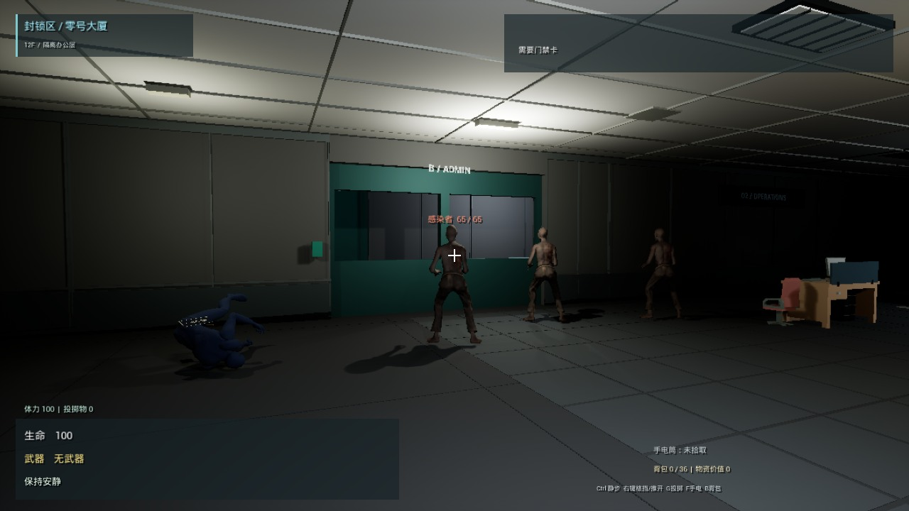

# 林顺 · 封锁区：零号大厦 · 作品集 V3

**关卡设计与玩法机制作品集 · 2026.09.25 · 10 页 · 两关可玩原型**

[阅读 PDF](Portfolio-V3.pdf) · [下载 PDF](https://github.com/mumusama75/LockdownZone/raw/main/Docs/Portfolio/V3/Portfolio-V3.pdf) · [可编辑源文件 ZIP](EditableSource.zip) · [源码与截图](source)

感染暴发后被封锁的医院后勤行政楼。玩家是一名设施维护人员，从维修值班室醒来，利用工具与声音诱导恢复电梯，前往地下车库，驾驶维修皮卡撤离。

## 阅读重点

| 页码 | 设计问题 |
|---|---|
| 1-3 | 在看得见电梯的前提下，怎样组织 B 门与 10→06 通风两条路线？ |
| 4 | 怎样用初次物资线索和手电获得建立可选回访？ |
| 5 | 为什么把全层风道收束为单一路线，付出了哪些自由度代价？ |
| 6 | 瓶子、对讲机与门的计时怎样共同影响接近窗口？ |
| 7-8 | 为什么电梯采用受保护的交互式收尾，输入与异常如何划分？ |
| 9 | 提前挪车、双障碍岛和开闸声如何形成不同返程选择？ |
| 10 | 个人贡献、第三方资源与待验证边界。 |

## 影像与证据边界

[电梯连续片段（MP4，约 20 秒，无声）](ElevatorFinale.mp4)为补充影像。核心玩法有声演示尚未完成，不将该片段作为声音听感证明。未提供打包试玩下载，也不把源码包标成可执行游戏。

关卡图为设计示意；截图为实际 UE 运行画面。代码及受控运行检查不等同于首次玩家的体验验证。第二关保持可玩灰盒状态。

## 贡献与资源

本人负责关卡布局、动线与引导、玩法规则、节奏及迭代决策。代码部分使用 Codex / Gemini 辅助实现；美术和动画复用 UE / GASP、Kenney CC0 与第三方资源，不作为个人独立编程、建模或动画制作成果。

Zombie Number 7 - Animated / Tony Flanagan：[原作](https://www.fab.com/listings/a5710c50-a98e-4b55-98f8-c0a0f8318a84)，[CC BY 4.0](https://creativecommons.org/licenses/by/4.0/)，项目调整网格组合、尺度与动画接入。

[项目待验证事项](Project-Validation-Backlog.md) · [V3 修改记录](V3-Changes.md)
