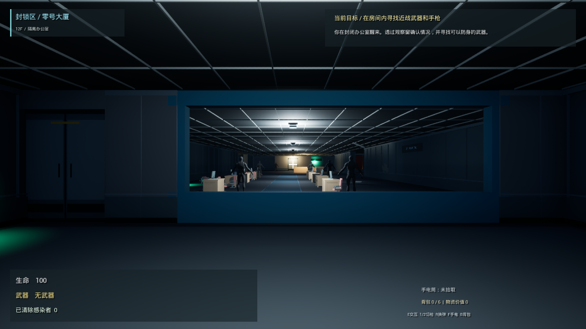
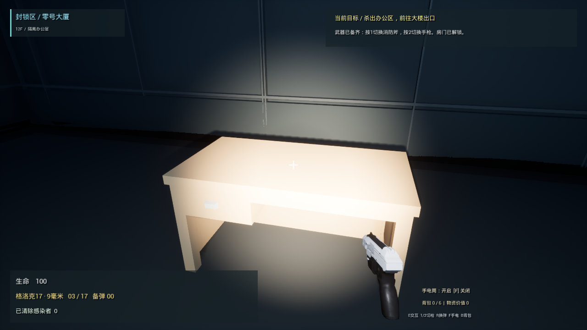
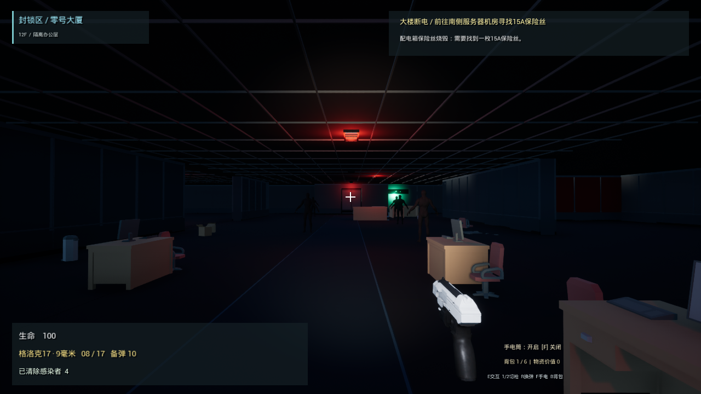
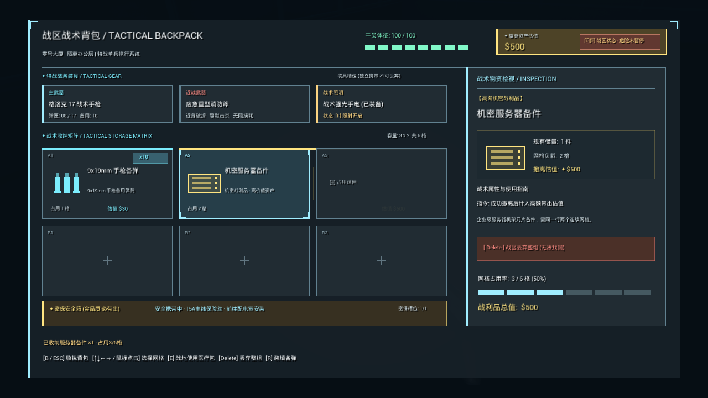

# 封锁区：零号大厦 / Lockdown Zone: Zero Tower

[](https://www.unrealengine.com/)
[](https://isocpp.org/)
[]()
[]()

UE 5.8 单人第一人称搜打撤关卡作品集项目。场景是一层封锁后的办公楼：玩家从办公室醒来，透过玻璃发现感染者，在有限弹药下获取武器、清理威胁，再应对断电、寻找保险丝并恢复撤离通路。

<p align="center">
  
  
</p>
<p align="center">
  
  
</p>

当前交付是**可运行的阶段性美术切片**。重点是空间阅读、资源压力和断电前后的路线变化。UE 官方手枪、Mannequin 和 Kenney CC0 家具已经进入项目；Manny 仍是感染者的临时表现，消防斧、交互动作和部分环境细节仍需后续美术迭代。项目不是最终品质成品，也没有将 10–15 分钟流程或玩家测试指标作为已验证结果。

## 当前流程

1. 在西侧办公室醒来；观察玻璃后的感染者，拾取消防斧和手枪。未武装时敌人保持静止，给玩家观察与学习的时间。
2. 手枪按格洛克 17 的玩法规格配置：弹匣容量 **17 发**，拾取后为 **3 / 0**（弹匣 / 备用），从场景弹药盒补充弹药。拾取武器带有短暂检视表现。
3. 破坏玻璃、战斗和搜集物资；第 **4 次击杀**触发办公层断电。
4. 前往南侧机房取得保险丝，回到北侧配电设施恢复供电。
5. 前往东侧出口交互撤离；死亡或完成后可按 F5 重新开始。

中文 HUD 展示当前目标、交互提示、生命与弹药等状态。场景通过 C++ 在运行时生成，启动地图使用引擎 Entry；无需手工新建关卡。空间设计、视觉引导和待验证问题见 [DESIGN.md](DESIGN.md)。

手枪开火带有镜头抬升、轻微横向偏移和枪身回弹，停止射击后平滑恢复，右键瞄准时后坐力较轻。开场手枪桌上另有可拾取手电筒，按 E 获取后自动开启、按 F 开关；光束随视角照射并受实体遮挡。手电可与斧或枪一起使用，不占背包格，本阶段不消耗电池。

## 本阶段已整合内容

办公层已使用模块化墙板、工业门和 **100×80×220 cm** 服务器机柜，保留真实多材质槽；修复了合并模块退回默认棋盘材质的问题。最近一次只读资产审计覆盖 24 个网格、56 个材质槽，结果为 0 空材质、0 默认材质。该结果确认资产关联，不等同于最终画面验收。

环境已加入通过实例化静态网格（ISM）布置的地毯和天花格栅，以及纸屑、破损、水痕与倒椅。场景内使用 ASCII 分区导向，中文 HUD 继续承担目标与交互提示。已固定曝光；本轮输出23张游戏截图，覆盖正常照明、断电应急灯、恢复供电、后坐力、手电开关，以及空包、物资入包和满包界面。

主线之外可选北侧办公绕行和南侧机房深搜。按 **B** 打开/关闭 **3×2、共6格** 背包，物品以实际条目保存；方向键选格，E使用选中医疗包，Delete丢弃整件/整堆物品（不可找回）。背包打开时世界继续运行，角色不能移动、转向、攻击或操作场景。现有物资为：

| 物资 | 效果 / 价值 | 背包占用 |
| --- | --- | --- |
| 9毫米弹药 | 每箱12发，换弹从背包中取用 | 每格最多30发，自动堆叠 |
| 医疗包 | 拾取后存储，背包内使用恢复35生命；满血不消耗 | 每件1格 |
| 电子零件 | 价值 120 | 1 格 |
| 服务器备件 | 每件价值 500 | 每件同一行连续2格 |

北侧布置医疗包、电子零件和一件备件；南侧机房布置另一件备件。三件计价物总价值1120、共占5格，弹药和医疗包也占空间，搜索时需要在补给与战利品之间分配容量。装不下时拾取物保留在场景，换弹耗尽弹药堆、使用医疗包或丢弃物品会释放格子。武器/手电列在独立装备栏，保险丝列在任务物品栏，均不挤占这6格。路线难度与通关时长仍待自然游玩测试。

## 操作

| 输入 | 功能 |
| --- | --- |
| WASD / 鼠标 | 移动 / 观察 |
| 空格 | 跳跃 |
| 鼠标左键 | 消防斧攻击 / 手枪射击 |
| 鼠标右键（按住） | 手枪瞄准 |
| 1 / 2 | 切换到已拾取的消防斧 / 手枪 |
| R | 换弹，需要备用弹药 |
| E | 拾取、操作配电设施、撤离 |
| F | 拾取手电筒后开关照明 |
| B | 打开 / 关闭背包 |
| 方向键 / E / Delete（背包内） | 选择格子 / 使用医疗包 / 丢弃选中物品（不可找回） |
| F5 | 重新开始 |

## 仓库与构建

以仓库中的 `projects/LockdownZone` 为准。本机同步版本位于 `C:/Users/木/Documents/ChatGPT/cv/projects/LockdownZone`，`C:/UEProjects/LockdownZoneRepo` 是指向该目录的 junction。历史目录 `C:/UEProjects/LockdownZone` 是旧开发副本，不应作为本阶段开发来源。

需要 UE 5.8、Visual Studio C++ 工具链与 Windows SDK。以下命令从项目目录执行：

```powershell
powershell -ExecutionPolicy Bypass -File .\Scripts\Build.ps1
powershell -ExecutionPolicy Bypass -File .\Scripts\Play.ps1
```

脚本从自身所在的 `Scripts` 目录定位项目；默认引擎为 `C:/Program Files/Epic Games/UE_5.8`，可通过 `-EngineRoot 'D:/Epic/UE_5.8'` 覆写。构建目标为 `LockdownZoneEditor Win64 Development`。编译前关闭使用此项目模块的编辑器或游戏进程；启动脚本不会隐式编译。

当项目路径含非 ASCII 字符时，脚本会创建或校验 `C:/UEProjects/LockdownZoneRepo` junction；可用 `-JunctionPath 'D:/UEProjects/LockdownZoneRepo'` 更改。已存在路径必须是指向本项目的 junction，否则明确报错，不会删除、覆盖或重新定向。脚本拒绝使用历史路径 `C:/UEProjects/LockdownZone`。junction 与仓库访问同一套文件，不产生第二份源码。

构建输出保存在 `Saved/Logs/Build-*.log` 与 `Saved/Logs/UBT-*.log`；运行日志为 `Saved/Logs/Play-*.log`。

## 回归与视觉检查

```powershell
powershell -ExecutionPolicy Bypass -File .\Scripts\Play.ps1 -QA
```

`-QA` 使用 `-LZSliceQA -LZQAExit` 启动开发回归驱动，窗口渲染分辨率固定为 1280×720；执行后返回游戏退出码。报告位于 `Saved/LZSliceQA_Report.txt`，截图位于 `Saved/Screenshots/WindowsEditor/SliceQA_*.png`。正常游玩不传这些参数。

2026-09-22 最新 Development Editor 编译成功，QA 已实际完成 **255 项通过 / 0 项失败**，返回码0。覆盖真实射击与后坐力、手电拾取/开关、B开关背包、方向键选格、容量与堆叠、满包拒收不丢物、医疗包使用/满血保留、丢弃与格子释放、换弹消耗实际库存、背包输入隔离及世界继续运行、物资带出和F5重开清空库存。QA 为稳定验证交互会暂时冻结敌人，因此该通过结果不代表完整自然战斗与难度平衡验收。

每轮改动都应完成：编译、运行回归、检查报告并打开本轮截图，再进行实际游玩确认。自动化可检查已覆盖的状态和生成画面，无法代替对引导清晰度、手感、碰撞和首次通关体验的人工评估。本阶段视觉检查已完成；自然游玩与战斗平衡仍需测试。

## 本阶段开场遮挡修复

开场巨大遮挡物的根因是第一人称消防斧子组件 `MeleeHead`：构造期间父组件的可见性传播没有可靠应用到子组件，导致未拾取武器时斧头仍出现在镜头前。修复对 `MeleeHead` 显式设置初始隐藏，并在 `BeginPlay` 按当前武器状态同步可见性。手枪拾取 Actor 的总包围盒包含交互/提示组件，不能仅凭该包围盒认定手枪网格本身巨大；网格尺寸和开场画面需要分别核验。

## 资产与维护

- UE 官方模板手枪和 Mannequin 用于武器及临时角色表现，遵循对应 Unreal Engine 内容许可；它们不是原创作品。手枪实例材质依赖共用的 `/Game/Weapons/Rifle/Materials/M_Weapon`，该父材质已从 UE 5.8 官方模板补齐，保留原路径。
- Kenney 家具为已导入的 CC0 资源，保留项目中随附的来源/许可记录；运行项目不需要外部 FBX 原文件。
- 自制墙板、工业门与机柜是轻量模块，见 [模块说明](Scripts/build_slice_art_README.md)。材质槽应保留，避免单一材质覆盖掉分缝、面板和指示灯。

可在启用 Python 插件的 UE 编辑器中执行 `Scripts/import_kenney_furniture.py` 来补充缺失家具。默认源目录为 `<project>/ExternalAssets/KenneyFurniture/Models/FBX format`；环境变量 `LZ_KENNEY_SOURCE` 可直接指定 FBX 所在目录。目录或所需源文件缺失时脚本清晰报错；已存在的 `/Game/Art/KenneyFurniture/SM_*` 资产跳过，不重复导入。该脚本不下载资源，也不修改已有家具资产。
