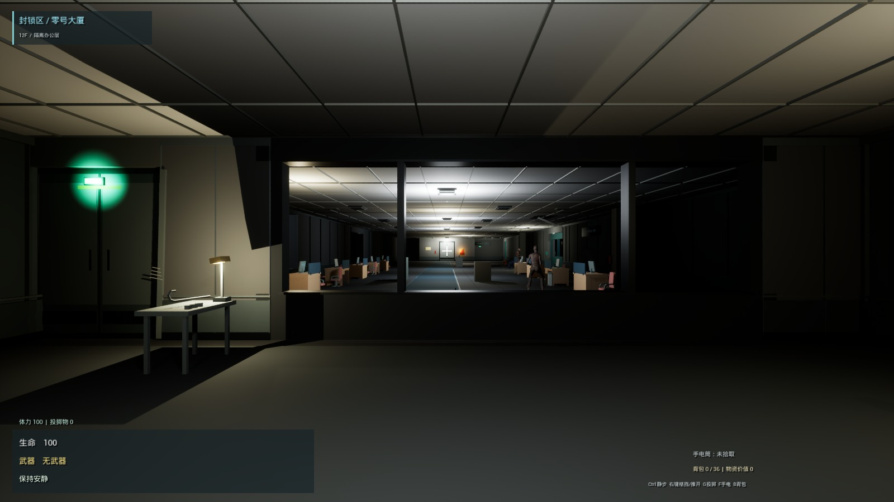
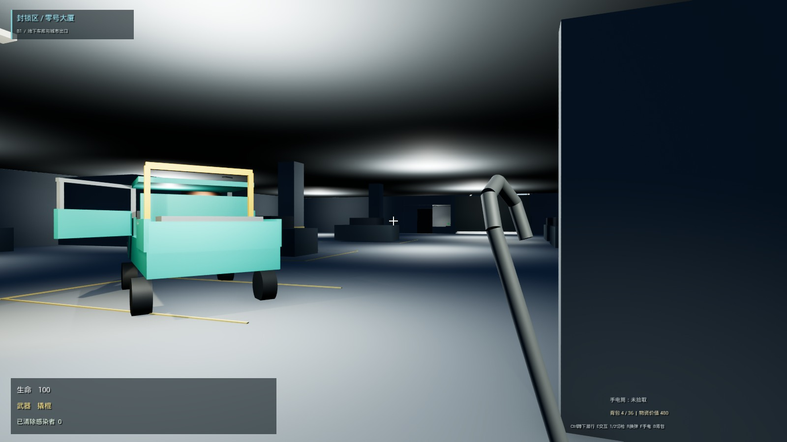

# 封锁区：零号大厦

**关卡设计与玩法机制作品集 · 两关可玩原型 · UE 5.8.2 / Windows / C++**

感染暴发后被封锁的医院后勤行政楼。玩家是一名设施维护人员，从维修值班室醒来，利用撬棍与声音诱导穿过封锁区域，恢复电梯，再驾驶维修皮卡离开地下后勤车库。

**[阅读作品集 V3（10 页 PDF）](Docs/Portfolio/V3/Portfolio-V3.pdf)** · [直接下载 PDF](https://github.com/mumusama75/LockdownZone/raw/main/Docs/Portfolio/V3/Portfolio-V3.pdf) · [可编辑源文件](Docs/Portfolio/V3/EditableSource.zip) · [截图与补充影像](Docs/Portfolio/V3/README.md)



## 设计重点

| 设计问题 | 当前选择与取舍 |
|---|---|
| 怎样绕过 B 门的感染者？ | 地面路线要求观察、投瓶引开、靠近保安取卡、刷门；通风路线用绕行、推柜和攀爬换取避开聚集区。 |
| 怎样避免风道替代所有地面探索？ | 从全层多出口收束为 10 会议室→06 档案室；落地后仍需经 D 门去配电间。 |
| 怎样让探索形成回路？ | 在 07 取得保险丝后，从内侧解锁 C 门，返回电梯附近；手电与茶水间奖励支持可选回访。 |
| 怎样收束第一关压力？ | 电梯卡门前保留自由应对，启动后进入受保护的按住撬门演出；牺牲这一段战术自由，自动入厢、闭门下行。 |
| 怎样保留第二关的玩家策略？ | 开闸前可以试驾、提前挪车；开闸不会复位车辆，Boss 可撞倒，也可绕过撤离。 |

## 第一关：后勤行政与设备管理层

1. 看见远处电梯，找到卡住的出口；在附近维修台拾取撬棍，撬门的金属声引来教学感染者。允许先拿工具，无需击杀才能离开。
2. 进入行政区有两条路线：**B 门声音诱导与门禁卡**，或 **A 门→10 会议室推柜攀入风道→06 档案室**。
3. 地面玩家同样可以从普通 D04 门进 06。经 D 门到 07 配电间取得保险丝，从内部解锁 C 门返回电梯；不增加隔离开关、密码或额外钥匙。
4. 恢复供电与主动呼梯分开。电梯停稳卡门后，在中央门缝启动 QTE；按住发力、松开暂停，完成后自动入梯回身、夹手关门、下行。
5. 正常跨关保留玩家、摄像机和轿厢，利用闭门阶段准备车库，再次开门进入 B1。未测量低配卡顿，不宣称零卡顿加载。

手电筒与 11 黑暗茶水间的手枪 / 急救包属于可选探索。当前奖励拾取需要**持有且开启手电**，是硬性条件，其直觉性仍需试玩验证。撬棍和门卡为持续权限，不占普通背包；中文 HUD 与 6×6 格子背包保留。

### 声音规则怎样服务通路

感染者调查最后听到的位置，不因看见安静玩家而持续锁定；近身接触仍有危险。瓶子、对讲机、脚步和撬门使用同一套听觉处理。

- 瓶子强声触发约 **0.65 秒**的可读反应；**12 秒调查承诺**避免弱电台立即改写目标。
- B 群搜索为 **8 秒**；电台按自己的 **14 秒周期**呼叫，后续可再次吸引。
- B 门从**完全打开**起保持 **7 秒**。有人占门则延长，清空至少 **1.2 秒**且保持计时满足后才关闭；内侧开门无需卡。

这些计时有不同起点，不能相加为保证通行时间。玩家接近、取卡和敌人移动仍随距离、落点与操作变化。


## 第二关：地下后勤车库与撤离道路

**可玩灰盒 / 迭代中。** 斜停维修皮卡、半开驾驶门和车内灯建立车辆识别；卷帘门停在开启途中，出口旁玻璃岗亭可见控制台。

玩家可以先试驾，也可直接撬开岗亭、按按钮恢复开闸。噪声引 Boss 接近出口，玩家回到车辆的实际位置；双障碍岛与外圈支持步行躲冲撞和自由驾驶绕行。高速撞倒或直接绕过 Boss 都可以成立，出口不以击杀为条件。坡道后接地面尸群撤离段。



## 观看与验证边界

- [作品集 V3](Docs/Portfolio/V3/README.md)：路线、玩家视角、取舍分析与机制规则。
- [电梯连续实录](Docs/Portfolio/V3/ElevatorFinale.mp4)：约 20 秒，无声；工具和门程序驱动，夹手仍为占位表现。
- [待验证事项](Docs/Portfolio/V3/Project-Validation-Backlog.md)：首次引导、声音窗口、奖励权限、驾驶手感与跨关性能。

已有开场、B 门、通风、驾驶与电梯的分阶段引擎检查。B 门 75 项、电梯 14 项为专项记录，并不表示一次最新完整真人通关。核心玩法有声演示待补，仓库暂不提供已验证的打包试玩下载。

## 运行与源码

仓库包含当前 C++ 实现、配置、生成与测试脚本，以及已整理的项目资产；不包含完整本机资源库和构建缓存。**复现截图需按 [资源依赖与运行边界](Docs/RepositorySetup.md) 准备动画等资源**，不能把克隆源码等同于下载可执行试玩包。

第一关采用运行时布置；第二关独立地图为 `/Game/Chapter2Greybox/Maps/L_GarageEscape`。

```powershell
.\Scripts\Build.ps1
.\Scripts\Play.ps1
# 第二关单独入口
.\Scripts\PlayGarageEscape.ps1
# 电梯卡门测试入口
.\Scripts\PlayElevatorFinale.ps1
```

需要 UE 5.8 和对应的 Visual Studio C++ 工具链。现有启动脚本默认使用 `C:/UEProjects/LockdownZoneRepo`，在其他电脑运行前须调整路径；启动不会自动编译。

默认操作：WASD / 鼠标移动与视角，E 交互，G 投掷，Ctrl / C 蹲行，Shift 奔跑，F 手电，B 背包，左键攻击，右键格挡 / 推开或瞄准，R 换弹，F5 重试。以 `Config/DefaultInput.ini` 和当前角色绑定为准。驾驶位可有限转动视角。

## 个人贡献、工具与资产

**林顺**：关卡布局、动线与引导、玩法规则、节奏与迭代决策。代码部分使用 **Codex / Gemini** 辅助实现。美术和动画复用 UE / GASP、Kenney CC0 及第三方资源，不作为个人独立编程、建模或动画制作成果。

- Kenney 家具：[CC0 许可](KENNEY_LICENSE.txt)。
- 普通感染者：Zombie Number 7 - Animated / Tony Flanagan，[原作](https://www.fab.com/listings/a5710c50-a98e-4b55-98f8-c0a0f8318a84)，[CC BY 4.0](https://creativecommons.org/licenses/by/4.0/)。项目调整组合、尺度与动画接入，见 [署名](SourceAssets/Zombie7/ATTRIBUTION.md)。
- 对讲机呼叫 / 静电、门声等有程序合成临时音频，尚非正式配音与完整混音。

旧 PDF、旧设计稿与验证目录保留为迭代历史。**当前对外介绍以本 README 和作品集 V3 为准**；旧“战斗触发断电”、钥匙→消防斧开场链与全层多出口风道已被替换。
